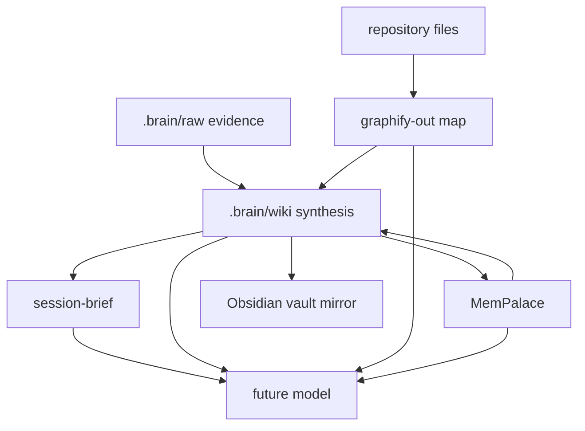

# Brain Architecture

The project brain is a six-layer continuity system. Each layer has a separate job so the agent can recover project understanding even after a context reset or model change.

## Layers

1. **Evidence** — `.brain/raw/` and repository files. Immutable source material and project truth.
2. **Synthesis** — `.brain/wiki/`. Compiled markdown knowledge maintained by the agent.
3. **Memory** — MemPalace. Verbatim session memory, diary entries, and persistent user preferences.
4. **Map** — graphify. Relationship graph over code, docs, sources, and wiki pages.
5. **Handoff** — `.brain/state/session-brief.md`. The short briefing a future model reads first.
6. **Vault** — Obsidian MCP. Optional mirror of wiki pages into the user's vault for browsing, graph view, and annotation.

## Responsibility split

- Evidence answers: "What actually exists?"
- Synthesis answers: "What does it mean?"
- Memory answers: "What happened before and what does the user prefer?"
- Map answers: "How are pieces connected?"
- Handoff answers: "What should the next model read first?"
- Vault answers: "How can the human browse and annotate this brain?"

## Flow

## Key rule

The wiki is not the last step. Every meaningful wiki change must update or consider index, links, decisions, graph, memory, open questions, logs, health, and handoff state.

